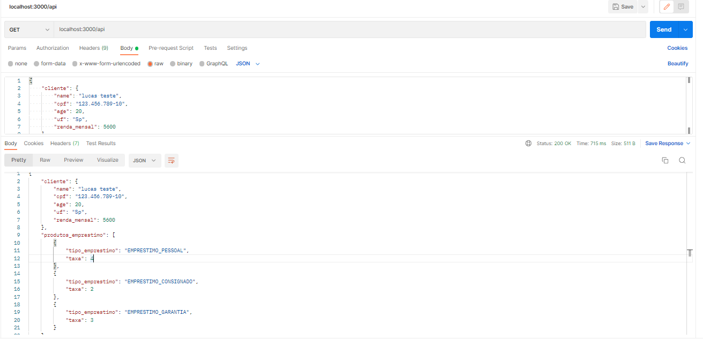

# API-Emprestimo
Criação de api teste que retorna porcentagem de juros e tipos de empréstimo a depender da localização e idade do cliente.

Instruções de uso : 
 - npm install 
 - npm start

<h3>Instruções de uso</h3>

 

<h3>Teste utilizando Postman.</h3>

 
